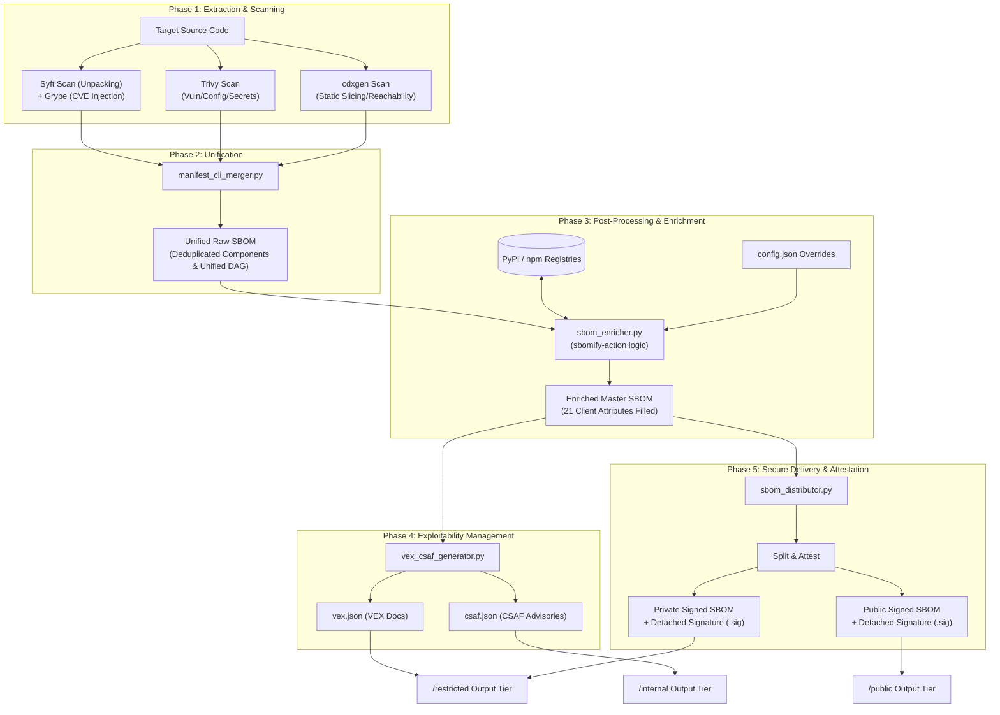
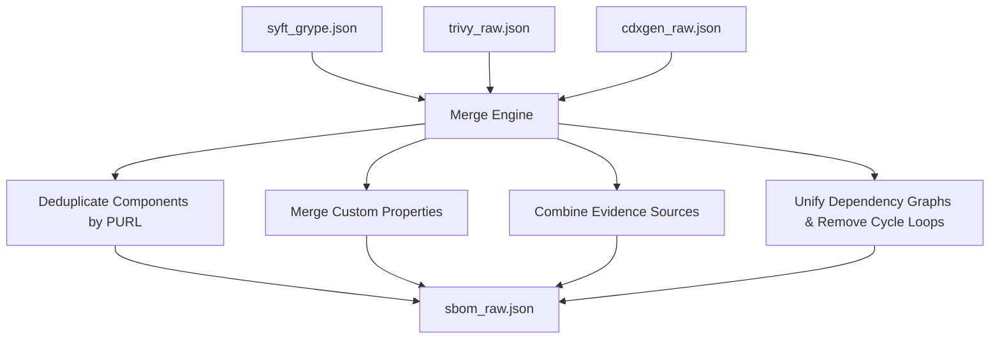
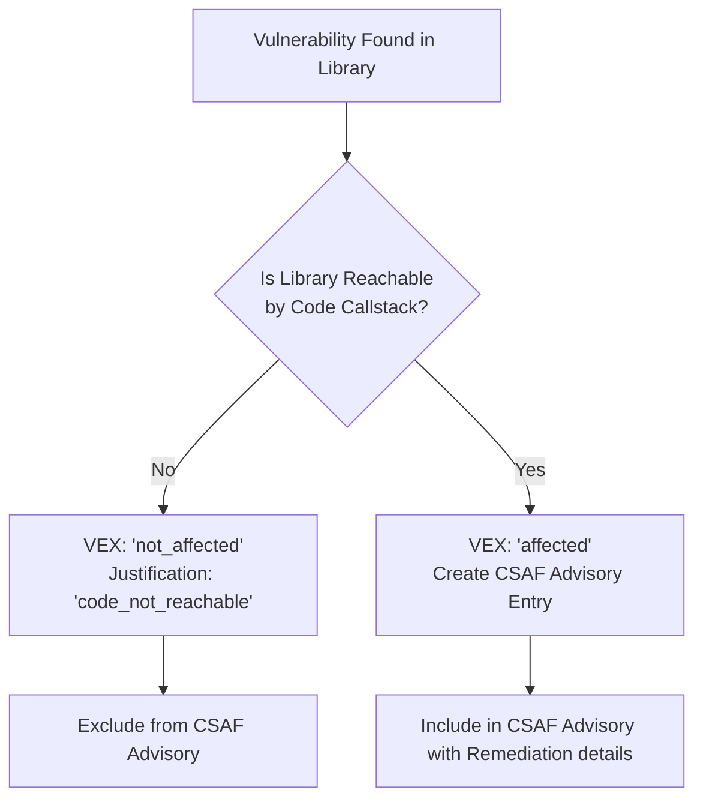
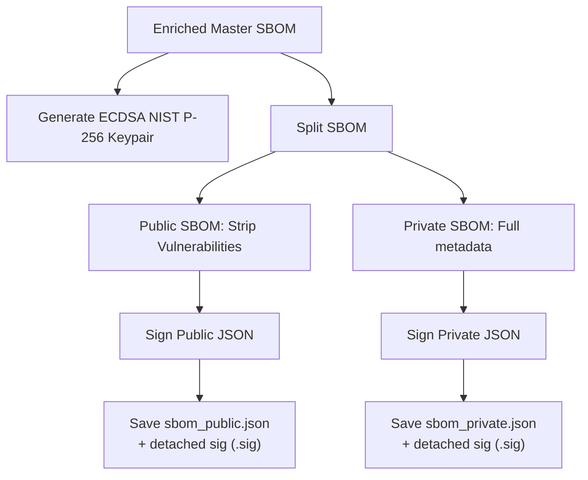

# Enterprise SBOM Integration Pipeline — Complete Project Workflow

This document details the complete, end-to-end software supply chain compliance pipeline integrated into this workspace. It balances deep scanner discovery with automated reachability triage (exploitability) and secure cryptographic delivery.

---

## High-Level Architecture Flow

The entire workflow is organized into **5 core phases** executing sequentially:

---

## Detailed Phases

### Phase 1: Deep Extraction & Scanning (The Generation Phase)
Three scanners target the source directory concurrently to eliminate detection blind spots:
1. **Syft + Grype**: Performs deep binary parsing (unpacking archives, finding statically linked libraries, looking at compiled builds) and immediately pipes the inventory to **Grype** to append CVE vulnerabilities. Output: `syft_grype.json`
2. **Trivy**: Scans filesystems/repositories to detect baseline open-source dependencies, exposed secrets (e.g. credentials), and configuration flaws. Output: `trivy_raw.json`
3. **cdxgen (Deep Mode)**: Invokes the `atom` engine and the `chen` library to perform static slicing. It traces execution paths from application entry points down to external dependency sinks to construct **vulnerability callstack evidence**. Output: `cdxgen_raw.json`

---

### Phase 2: Unification (The Merging Phase)
The three raw SBOM CycloneDX files are passed to `manifest_cli_merger.py`:

- **Deduplication**: Resolves packages using PURL naming. If a component is found in multiple inputs, it is merged into one, and `detected_by` lists the discovery tools.
- **Dependency Map**: Unifies dependencies lists and runs a depth-first search (DFS) to locate and eliminate circular loops, outputting a clean Directed Acyclic Graph (DAG) for client admission controllers.

---

### Phase 3: Business Data Enrichment (The Post-Processing Phase)
The raw unified SBOM contains technical coordinates but lacks regulatory business data. `sbom_enricher.py` parses `sbom_raw.json` and uses `config.json` to query package registries (like PyPI) to inject the **21 mandatory compliance attributes**:

| Attribute | Field Name | Description | Source |
|---|---|---|---|
| Attr 1 | **Component Name** | Unique package identifier | Scanners |
| Attr 2 | **Version** | Version string | Scanners |
| Attr 3 | **Description** | Human-readable overview | Registry Query / Fallback |
| Attr 4 | **Supplier** | Author/organization name | Registry Query / `config.json` |
| Attr 5 | **License** | Package license type | Registry Query / `config.json` |
| Attr 6 | **Origin** | Open-source/proprietary classification | `config.json` |
| Attr 7 | **Dependencies** | Target packages called | Unified Scanner DAG |
| Attr 8 | **Vulnerabilities** | Associated CVE list | Trivy/Grype scan |
| Attr 9 | **Patch Status** | `up-to-date` or `patch-available` | Computed against latest registry version |
| Attr 10 | **Release Date** | ISO 8601 publish date | Registry Query |
| Attr 11 | **EOL Date** | Support EOL date | Computed (`Release Date + Offset`) |
| Attr 12 | **Criticality** | `critical`/`high`/`medium`/`low` rating | Scored by package type & crypto presence |
| Attr 13 | **Usage Restrictions**| Constraints on framework use | `config.json` |
| Attr 14 | **Hash** | Package integrity checksum | Scanners |
| Attr 15 | **Comments** | Framework audit notes | `config.json` |
| Attr 16 | **Author of SBOM** | Creator of the report document | Git Remote Config / `config.json` |
| Attr 17 | **Timestamp** | Date generated | System Clock |
| Attr 18 | **Executable** | Type (Executable/Library/Script) | Binary header checking / Heuristics |
| Attr 19 | **Archive** | Archive compression details | Compression inspections on disk |
| Attr 20 | **Structured** | Format descriptor | `config.json` |
| Attr 21 | **Unique Identifier**| Package URL (PURL) | Reformatted PURL string |

---

### Phase 4: Exploitability Management (The VEX Phase)
Before delivery, security analysts filter out false-positives by evaluating reachability callstack evidence from cdxgen:

- **Not Affected**: If `cdxgen` callstack analysis proves that the application's code path never reaches or invokes functions in the vulnerable package, it is flagged as `"not_affected"` in `vex.json` with the justification `"code_not_reachable"`. 
- **CSAF Advisory**: Reachable, active vulnerabilities are logged in `csaf.json` alongside vendor remediation details (e.g. `"Upgrade requests to 2.22.0"`).

---

### Phase 5: Secure Delivery & Attestation (The Final Phase)
To guarantee data integrity and protect sensitive internal findings, `sbom_distributor.py` processes the final artifacts:

- **Attestation**: Generates an ECDSA key pair. Deterministic JSON canonicalization guarantees signature stability. The signature is embedded directly in the CycloneDX `signature` block and written as a detached `.sig` file.
- **Organization**: Distributes deliverables into three secure folders:
  - **`sbom_output/public/`**: Public SBOM (no vulnerabilities, signed), public key, HTML and Excel compliance reports.
  - **`sbom_output/restricted/`**: Private SBOM (signed), VEX document (`vex.json`), enriched SBOM, and private key.
  - **`sbom_output/internal/`**: Governance map (`internal_map.json`) and CSAF advisory (`csaf.json`).
