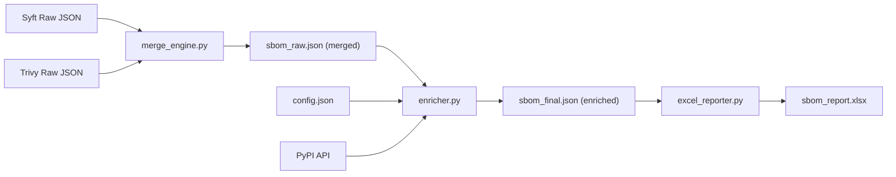

# SBOM Report (`sbom_report.xlsx`) — Column Explanation

> [!IMPORTANT]
> **Auditor Mathematical Verification & Proof of Existence**
> For detailed mathematical formulas, statistical calculations, and verification code scripts used to prove the physical existence of SBOM components in the target system, please refer to the [SBOM Auditor Verification Report](file:///c:/Users/ADMIN/OneDrive/Desktop/BOM/BOM/sbom_component_existence_proof.md).

The report is a **7-sheet Excel workbook** generated by [excel_reporter.py](file:///d:/College%20Work/Internship/BOM/Merge%20Engine/excel_reporter.py). Its data flows through a 3-stage pipeline:

---

## Sheet 1 — Dashboard

KPI cards and a vulnerability severity table. No per-row data columns; values are computed statistics.

| Card / Row | Value Source |
|---|---|
| TOTAL COMPONENTS | `len(sbom['components'])` — count of final deduplicated components |
| MERGED COMPONENTS | `merge_engine:common_total` metadata property — components found by **both** Syft and Trivy |
| DUPLICATES REMOVED | `(syft_total + trivy_total) - final_total` |
| SYFT COMPONENTS | `merge_engine:syft_total` metadata property |
| TRIVY COMPONENTS | `merge_engine:trivy_total` metadata property |
| UNIQUE LICENSES | Count of distinct license names across all components |
| MERGE SUCCESS RATE | `common_total / (syft_total + trivy_total) × 100` |
| COVERAGE PERCENTAGE | `(components with merge_status containing "Merged") / final_total × 100` |
| ACTIVE VULNERABILITIES | `len(sbom['vulnerabilities'])` |
| Severity Table (Critical/High/Medium/Low) | Counted from `vulnerabilities[].ratings[0].severity` |

---

## Sheet 2 — Executive Summary

Narrative text blocks; no data columns. Values reference the same `stats` dictionary used by the Dashboard.

---

## Sheet 3 — Component Data (27 Columns)

This is the **master catalog**. Each row is one deduplicated component.

| # | Column Name | Why It Exists | Where the Value Comes From |
|---|---|---|---|
| 1 | **Sr No** | Row counter for reference | Auto-incremented integer (`r_idx + 1`) |
| 2 | **Component Name** | Identifies the software package | `component.name` — originally from **Syft** or **Trivy** raw scan output; normalized by [merge_engine.py:L128](file:///d:/College%20Work/Internship/BOM/Merge%20Engine/merge_engine.py#L128) |
| 3 | **Version** | Tracks the exact installed version | `component.version` — from scanner output; if missing, [enricher.py:L588-589](file:///d:/College%20Work/Internship/BOM/Merge%20Engine/enricher.py#L588-L589) defaults it to `"1.0.0"` |
| 4 | **Description** | Human-readable summary of what the package does | Fetched live from **PyPI JSON API** by [enricher.py:L28](file:///d:/College%20Work/Internship/BOM/Merge%20Engine/enricher.py#L28) (`info.summary`); falls back to scanner data or `"Python package <name>"` |
| 5 | **Supplier** | The author, maintainer, or organization publishing the package | Priority chain: `config.json` overrides → **PyPI API** `info.author` → `config.default_supplier` ([enricher.py:L618](file:///d:/College%20Work/Internship/BOM/Merge%20Engine/enricher.py#L618)) |
| 6 | **License** | The SPDX or free-text license governing usage | From **PyPI API** `info.license` → fallback `config.default_license` (e.g., `"Apache-2.0"`) ([enricher.py:L619](file:///d:/College%20Work/Internship/BOM/Merge%20Engine/enricher.py#L619)) |
| 7 | **Origin** | Whether the component is open-source, proprietary, or internal | From `config.json` overrides or `config.default_origin` (typically `"open-source"`) — set as a property in [enricher.py:L721](file:///d:/College%20Work/Internship/BOM/Merge%20Engine/enricher.py#L721) |
| 8 | **Dependencies** | Lists other packages this component depends on | Resolved from `sbom.dependencies[]` — the dependency DAG built by [merge_engine.py:L256-307](file:///d:/College%20Work/Internship/BOM/Merge%20Engine/merge_engine.py#L256-L307) (combines Syft + Trivy deps, eliminates cycles) |
| 9 | **Vulnerabilities** | Count of known CVEs affecting this component | Counted by matching `vulnerability.affects[].ref` to the component's `bom-ref` in [excel_reporter.py:L313-318](file:///d:/College%20Work/Internship/BOM/Merge%20Engine/excel_reporter.py#L313-L318); vulnerability data originates from **Trivy's** security scan |
| 10 | **Patch Status** | Whether the installed version is current or outdated | Computed in [enricher.py:L644](file:///d:/College%20Work/Internship/BOM/Merge%20Engine/enricher.py#L644): `"up-to-date"` if installed version == latest PyPI version, else `"patch-available"` |
| 11 | **Release Date** | When this specific version was published | Fetched from **PyPI API** `releases[version][0].upload_time_iso_8601` ([enricher.py:L39-43](file:///d:/College%20Work/Internship/BOM/Merge%20Engine/enricher.py#L39-L43)); falls back to current UTC timestamp |
| 12 | **EOL Date** | Estimated end-of-life date for the version | Calculated as `release_date + config.eol_years_from_release` (default **3 years**) in [enricher.py:L634-642](file:///d:/College%20Work/Internship/BOM/Merge%20Engine/enricher.py#L634-L642) |
| 13 | **Criticality** | Risk classification (Critical / High / Medium / Low) | Scored by [enricher.py:L489-517](file:///d:/College%20Work/Internship/BOM/Merge%20Engine/enricher.py#L489-L517) based on: is it cryptographic (+40), runtime (+30), OS-level (+20), baseline (+15). Can be overridden in `config.json` |
| 14 | **Usage Restrictions** | Any legal or policy constraints on usage | From `config.json` per-package overrides → `config.default_usage_restrictions` (`"None"`) — [enricher.py:L646](file:///d:/College%20Work/Internship/BOM/Merge%20Engine/enricher.py#L646) |
| 15 | **Hash** | Cryptographic integrity fingerprint (SHA-256) | From scanner output (`component.hashes[0].content`); if missing, [enricher.py:L604-607](file:///d:/College%20Work/Internship/BOM/Merge%20Engine/enricher.py#L604-L607) generates `SHA-256(name@version)` as synthetic hash |
| 16 | **Comments** | Free-text audit notes | From `config.json` per-package overrides → `config.default_comments` (`"Merged and reconciled from Syft & Trivy SBOM feeds"`) — [enricher.py:L645](file:///d:/College%20Work/Internship/BOM/Merge%20Engine/enricher.py#L645) |
| 17 | **Author** | Who generated/owns this SBOM data | Resolved in [enricher.py:L756-759](file:///d:/College%20Work/Internship/BOM/Merge%20Engine/enricher.py#L756-L759): Git remote origin owner → project config file author → `config.author_name`. Stored in `metadata.authors[0].name` |
| 18 | **Timestamp** | When this SBOM was generated | `metadata.timestamp` — set to current UTC time during enrichment ([enricher.py:L764](file:///d:/College%20Work/Internship/BOM/Merge%20Engine/enricher.py#L764)) |
| 19 | **Executable** | Component type classification (Executable / Library / Script / Service / Container / Package) | Detected by [enricher.py:L248-350](file:///d:/College%20Work/Internship/BOM/Merge%20Engine/enricher.py#L248-L350) by inspecting: binary headers (MZ/ELF/shebang/PK), file extensions, PURL ecosystem, and naming patterns |
| 20 | **Archive** | Whether the component is a compressed archive (`true`/`false`) | Determined by [enricher.py:L352-444](file:///d:/College%20Work/Internship/BOM/Merge%20Engine/enricher.py#L352-L444): inspects ZIP/TAR/WHL/JAR files on disk; `"true"` if archive type is recognized |
| 21 | **Structured** | The structured data format of the SBOM itself | Static value from `config.default_structured_format` — typically `"CycloneDX JSON v1.6 (Merged)"` ([enricher.py:L733](file:///d:/College%20Work/Internship/BOM/Merge%20Engine/enricher.py#L733)) |
| 22 | **PURL** | Package URL — the universal package identifier | Originally from scanner output; normalized by [merge_engine.py:L8-25](file:///d:/College%20Work/Internship/BOM/Merge%20Engine/merge_engine.py#L8-L25) and reformatted by enricher to `pkg:<ecosystem>/<name>@<version>` |
| 23 | **Detected By** | Which scanner(s) found this component (`syft`, `trivy`, or both) | Set during merge correlation in [merge_engine.py:L138,173,198,228](file:///d:/College%20Work/Internship/BOM/Merge%20Engine/merge_engine.py#L138); `["syft", "trivy"]` if both scanners detected it |
| 24 | **Evidence Source** | File paths or scan methods that prove the component's presence | Syft: extracted from `syft:location:*:path` properties ([merge_engine.py:L107-112](file:///d:/College%20Work/Internship/BOM/Merge%20Engine/merge_engine.py#L107-L112)). Trivy: extracted from `Class` properties ([merge_engine.py:L162-166](file:///d:/College%20Work/Internship/BOM/Merge%20Engine/merge_engine.py#L162-L166)) |
| 25 | **Merge Confidence** | How confident the engine is in the merge match (`100%` or `75%`) | Set by [merge_engine.py:L140,201](file:///d:/College%20Work/Internship/BOM/Merge%20Engine/merge_engine.py#L140): **100%** for exact PURL match, **75%** for fuzzy name+version match |
| 26 | **Merge Status** | How this component entered the final SBOM | Set by [merge_engine.py:L141,174,200,231](file:///d:/College%20Work/Internship/BOM/Merge%20Engine/merge_engine.py#L141): `"Original"` (unique to one scanner), `"Merged"` (exact PURL match), or `"Merged (Fuzzy Name/Version)"` |
| 27 | **Unique Component ID** | UUID to uniquely identify this component record | Generated as `uuid.uuid4()` during merge in [merge_engine.py:L142](file:///d:/College%20Work/Internship/BOM/Merge%20Engine/merge_engine.py#L142) |

> [!NOTE]
> The header says "28 Columns" but the actual data columns are **27** (Sr No through Unique Component ID). The title is slightly off.

---

## Sheet 4 — Vulnerability Matrix (11 Columns)

Each row is one CVE–component pairing.

| # | Column Name | Why It Exists | Where the Value Comes From |
|---|---|---|---|
| 1 | **Sr No** | Row counter | Auto-incremented |
| 2 | **CVE ID** | The CVE identifier for the vulnerability | `vulnerability.id` from **Trivy's** vulnerability scan data |
| 3 | **Component Name** | Which package is affected | Looked up from `sbom.components[]` by matching `vulnerability.affects[].ref` to `component.bom-ref` or `purl` |
| 4 | **Version** | Affected version of the component | `component.version` of the matched component |
| 5 | **Ecosystem** | Package ecosystem (pypi / npm / maven / go / cargo / generic) | Derived from PURL prefix by [excel_reporter.py:L108-122](file:///d:/College%20Work/Internship/BOM/Merge%20Engine/excel_reporter.py#L108-L122) |
| 6 | **Severity** | Risk level (CRITICAL / HIGH / MEDIUM / LOW) | `vulnerability.ratings[0].severity` — from Trivy's CVSS assessment |
| 7 | **CVSS Score** | Numeric vulnerability severity score (0–10) | `vulnerability.ratings[0].score` — from Trivy |
| 8 | **Exploitation Status** | Current threat status | Hard-coded to `"Active Vulnerability"` in [excel_reporter.py:L444](file:///d:/College%20Work/Internship/BOM/Merge%20Engine/excel_reporter.py#L444) |
| 9 | **Remediation** | Recommended fix action | `vulnerability.advisories[0].title`; defaults to `"Update Version"` if no advisory exists |
| 10 | **Evidence Source** | How the component was discovered | From `component.evidence_sources[]` — same as Component Data sheet |
| 11 | **Detected By** | Which scanner(s) found the component | From `component.detected_by[]` — same as Component Data sheet |

---

## Sheet 5 — Component Correlation (9 Columns)

Shows how each component was matched between the two scanners.

| # | Column Name | Why It Exists | Where the Value Comes From |
|---|---|---|---|
| 1 | **Sr No** | Row counter | Auto-incremented |
| 2 | **Component Name** | Package identity | `component.name` |
| 3 | **Version** | Package version | `component.version` |
| 4 | **Detected by Syft** | Was it found by the Syft scanner? | `"Yes"` if `"syft"` is in `component.detected_by[]`, else `"No"` |
| 5 | **Detected by Trivy** | Was it found by the Trivy scanner? | `"Yes"` if `"trivy"` is in `component.detected_by[]`, else `"No"` |
| 6 | **Merged** | Was the component a merge of both scanner outputs? | `"Yes"` if `component.merge_status` contains `"Merged"`, else `"No"` |
| 7 | **Final Status** | Merge classification | `component.merge_status` — `"Original"`, `"Merged"`, or `"Merged (Fuzzy Name/Version)"` |
| 8 | **Match Score** | Confidence in the correlation | `component.merge_confidence` — `"100%"` or `"75%"` |
| 9 | **Reason / Audit Logging** | Explanation of the matching logic used | Dynamically composed in [excel_reporter.py:L497-501](file:///d:/College%20Work/Internship/BOM/Merge%20Engine/excel_reporter.py#L497-L501): PURL match, fuzzy match, or unique detection |

---

## Sheet 6 — Merge Statistics (3 Columns)

Summary metrics comparing scanner outputs.

| # | Column Name | Why It Exists | Where the Value Comes From |
|---|---|---|---|
| 1 | **Metric Description** | Label for the metric | Static strings defined in [excel_reporter.py:L542-549](file:///d:/College%20Work/Internship/BOM/Merge%20Engine/excel_reporter.py#L542-L549) |
| 2 | **Value** | The metric value | Computed `stats` dictionary (same as Dashboard) |
| 3 | **Notes / Analysis** | Contextual explanation | Static descriptive strings |

Metrics reported: Syft Total, Trivy Total, Common Correlated, Discarded Duplicates, Final Merged Inventory, Merge Efficiency Rate, Matching Coverage.

---

## Sheet 7 — License Summary (5 Columns)

Groups components by license and assesses compliance risk.

| # | Column Name | Why It Exists | Where the Value Comes From |
|---|---|---|---|
| 1 | **Sr No** | Row counter | Auto-incremented |
| 2 | **License ID** | The license name/identifier | `component.licenses[0].license.name` — populated by enricher from PyPI API or config defaults |
| 3 | **Occurrence Count** | How many components use this license | `len(components_using_license)` — grouped count |
| 4 | **Calculated Compliance Risk** | Risk assessment of the license type | Categorized in [excel_reporter.py:L599-610](file:///d:/College%20Work/Internship/BOM/Merge%20Engine/excel_reporter.py#L599-L610): **Copyleft/High** (GPL, AGPL, LGPL), **Permissive/Low** (MIT, Apache, BSD, ISC), or **Moderate** (everything else) |
| 5 | **Components Using License** | Comma-separated list of component names | All `component.name` values grouped under this license |

---

## Summary of Data Sources

| Source | What It Provides |
|---|---|
| **Syft scanner** (`syft_raw.json`) | Component names, versions, PURLs, hashes, file locations, CPEs, licenses, dependencies |
| **Trivy scanner** (`trivy_raw.json`) | Component names, versions, PURLs, licenses, **vulnerabilities** (CVEs, CVSS scores, severity, advisories), dependencies |
| [merge_engine.py](file:///d:/College%20Work/Internship/BOM/Merge%20Engine/merge_engine.py) | Correlation logic (PURL exact match / fuzzy match), merge_status, merge_confidence, detected_by, evidence_sources, unique_component_id, deduplicated dependency DAG |
| [enricher.py](file:///d:/College%20Work/Internship/BOM/Merge%20Engine/enricher.py) | Description, supplier, license, release_date, eol_date, patch_status, criticality, origin, executable type, archive metadata, structured format, comments, usage_restrictions, author, timestamp |
| **PyPI JSON API** (live) | Package description, author, license string, latest version, per-version release dates |
| [config.json](file:///d:/College%20Work/Internship/BOM/Merge%20Engine/config.json) | Default values, per-package overrides (supplier, criticality, comments, usage_restrictions), EOL calculation period, author metadata |
| **Git metadata** | SBOM author name (from `git remote` or `git config user.name`) |
| **Project config files** | Author from `pyproject.toml`, `package.json`, `setup.py`, or `pom.xml` |
